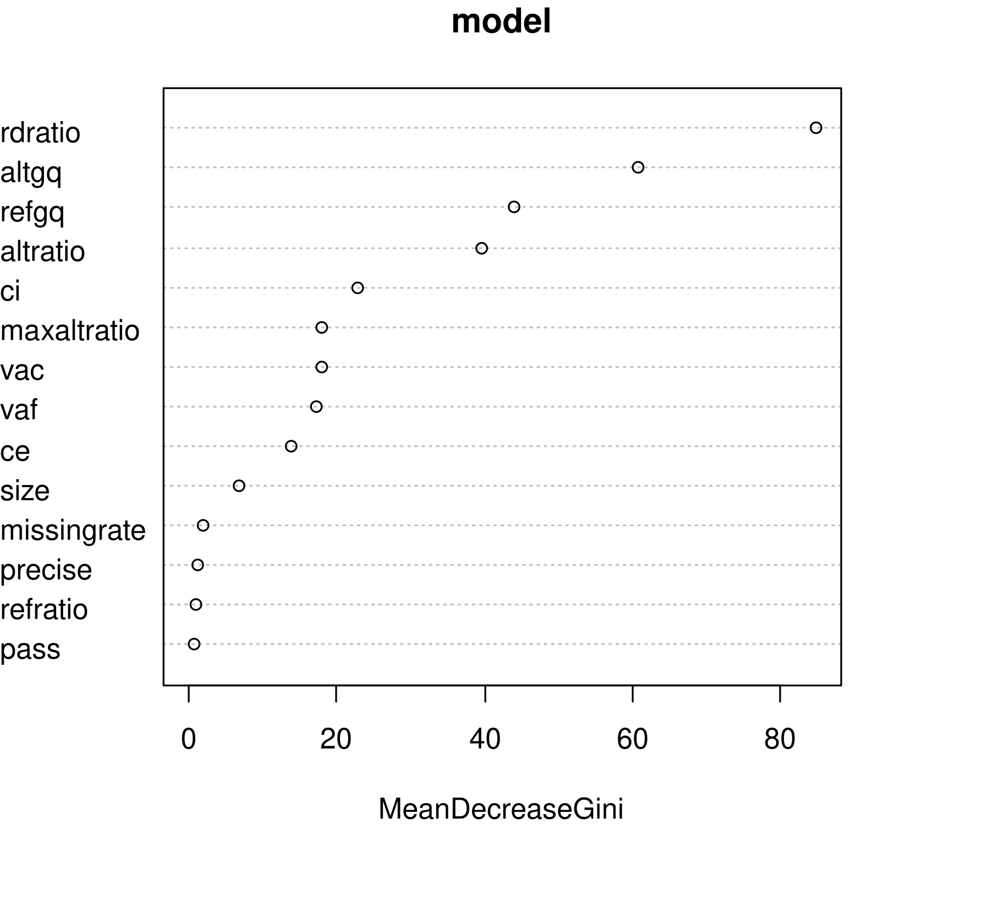

# Machine Learning Programming Exercise
I've firstly implemented a variety of standard classification algorithms (decision tree, k-nearest neighbors, random forests, naive bayes, support vector machines, linear discriminant analysis and neural network) and tested their initial accuracy on the testing data.

## Initial Accuracy
| Type | Accuracy |
--- | --- 
| rpart | 0.9617 | 
| knn | 0.9477 |
| nb | 0.9574 |
| rf | 0.9791 |
| svm | 0.9721 |
| lda | 0.9582 |
| nn | 0.9547 |

I originally planed to use *random forests* and as this particular algorithm proved to be quite viable, I've settled down with it.

## Tweaking RF
If we build a simple RF model and plot it:

    model = randomForest(formula = status ~ ., data = data$training, trControl=trctrl)
    plot(model)

We can see, that 500 trees is about the optimal amount.

")

Here we can see that the most important features are *rdratio, altgq, refgq and altratio*.

    varImpPlot(model)

And finally by using `tuneRF` we can estimate the ideal number of predictors at each split.

    model_tuned <- tuneRF(
        x=data$training[,-15], # exclude status
        y=data$training$status, 
        ntreeTry=500,
        mtryStart=2, 
        stepFactor=1.5,
        improve=0.01,
        trace=FALSE # don't show real-time progress
    )

## Results
I modified the random forest parameters with this knowledge in mind and also increased the tune length. This resulted in the final accuracy of **98.26 %**.

    Reference
    Prediction      0   1
                0  47   2
                1   3 235
                                            
    Accuracy : 0.9826          
    95% CI : (0.9598, 0.9943)
    No Information Rate : 0.8258          
    P-Value [Acc > NIR] : <2e-16          
                                            
    Kappa : 0.939           
                                            
    Mcnemar's Test P-Value : 1               
                                            
        Sensitivity : 0.9916          
        Specificity : 0.9400          
        Pos Pred Value : 0.9874          
        Neg Pred Value : 0.9592          
        Prevalence : 0.8258          
        Detection Rate : 0.8188          
        Detection Prevalence : 0.8293          
        Balanced Accuracy : 0.9658          
                                            
        'Positive' Class : 1

__Also I deeply appologize for the *very* late submission :(__

