# Generating Read-depth Plot
I've firstly indexed the [reference genome](http://hgdownload.cse.ucsc.edu/goldenPath/hg19/chromosomes/) using **bwa**.

`bwa index chrX.fa.gz`

Aligned the reads:

`bwa mem chrX.fa.gz wt.r1.fq.gz wt.r2.fq.gz > results-wt/alignment.bam`

Sorted them using **samtools**:

`samtools sort results-wt/alignment.bam -o results-wt/sorted.bam`

Then I was able to calculated the read-depth:

`samtools depth results-wt/sorted.bam > results-wt/output.txt`

I have also compiled all the above commands into one pipeline:

`./pipeline.sh data/chrX.fa.gz data/wt.r1.fq.gz data/wt.r2.fq.gz "Control Sample" control.png`

To visualize the data I created a short python script *plot.py* using  **seaborn, matplotlib, numpy & statistics**.

`python3 plot.py results-wt/output.txt "Control Sample" control.png -s`

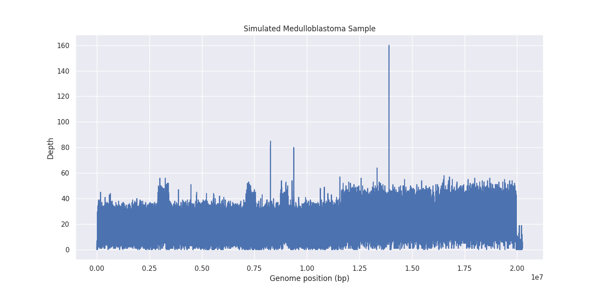
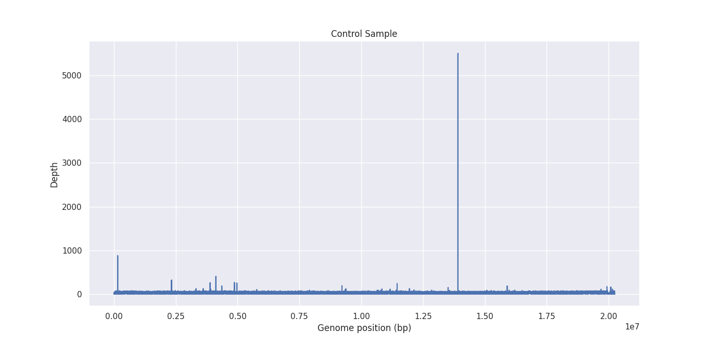

Using my script I also generated graphs for mean, meadian and 95th percentile per 100 bp.

`python3 plot.py output.txt "Simulated Medulloblastoma Sample" output.png -n 100 quantile 0.95`

> See *graphs.sh* for all the commands.

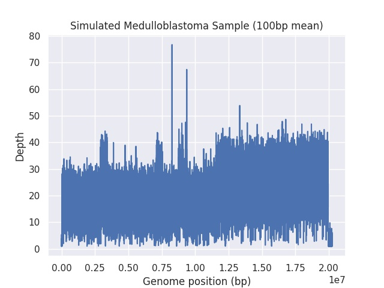

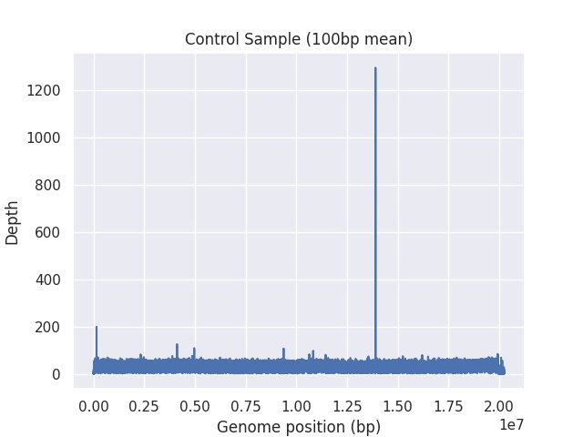

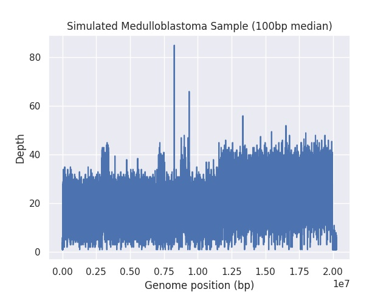

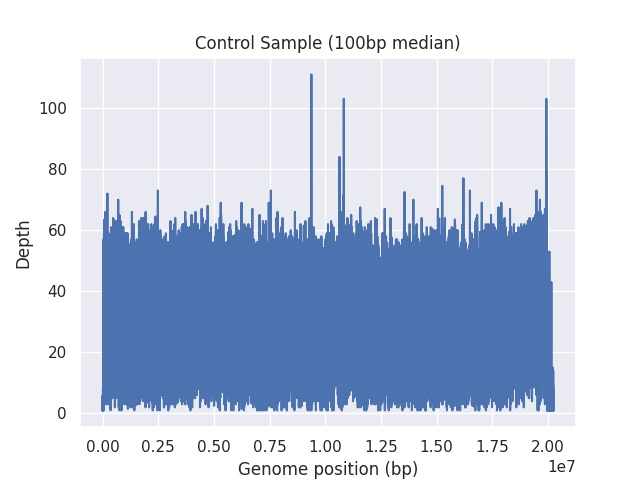

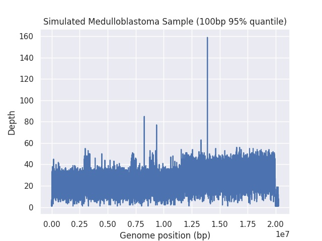

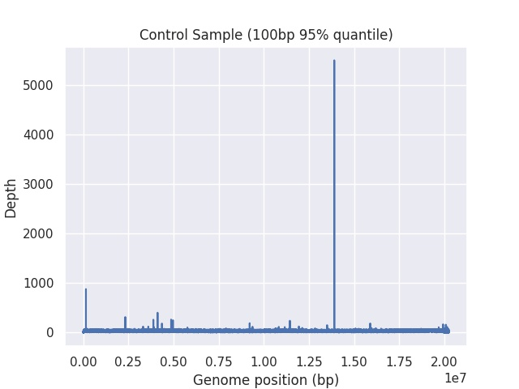

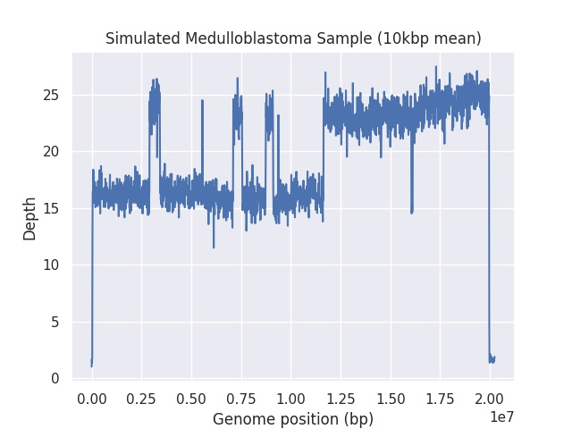

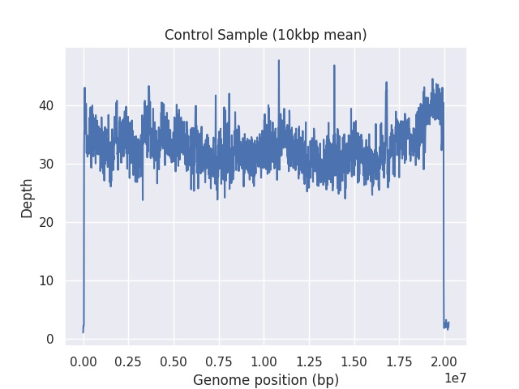

# SV Calling
Using **sniffles** I performed the SV calling. I dropped the threshold down to 5 to increase the amount of predicted variations although this increases the amount of false-positives.

`./sniffles -m results-tu/sorted.bam -v cv-call.vcf -s 5`

| Type | ID | Chr | Begin | End | Length |
--- | --- | --- | --- | --- | ---
| DEL | 0 | chrX | 22672579 | 22672881 | -302 |
| DEL | 1 | chrX | 25947956 | 25948274 | -318 |
| DEL | 2 | chrX | 31652080 | 31652119 | -39 |
| DUP | 3 | chrX | 31928323 | 31928365 | 42 |
| DEL | 4 | chrX | 32391265 | 32391580 | -315 |
| DEL | 5 | chrX | 32408509 | 32408587 | -78 |
| DUP | 6 | chrX | 32968047 | 32968087 | 40 |
| DEL | 7 | chrX | 33208594 | 33208905 | -311 |
| DUP | 8 | chrX | 34829036 | 34829138 | 102 |
| DEL | 9 | chrX | 38592550 | 38592587 | -37 |

Using modified *plot.py* the positions of SV were plotted to obtain the following:

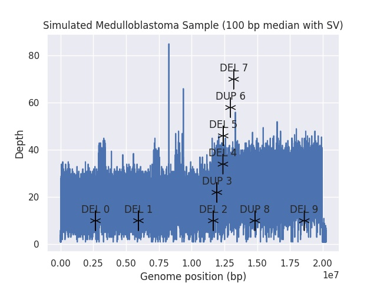

However, I suppose that *sniffles* was not setup correctly and I might have made errors during the mapping, as the result does not look as expected.